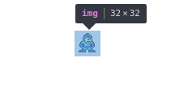
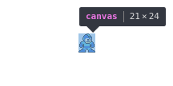

# image-clip
> Clip out transparent pixels from an image

Converts an image or canvas like this:



to a canvas with the edges clipped off:



## Installation
```sh
npm install semibran/image-clip
```

## Usage
```javascript
const clip = require('image-clip')
clip(image)
```

Returns an `HTMLCanvasElement` containing the resulting image.

## License
MIT
